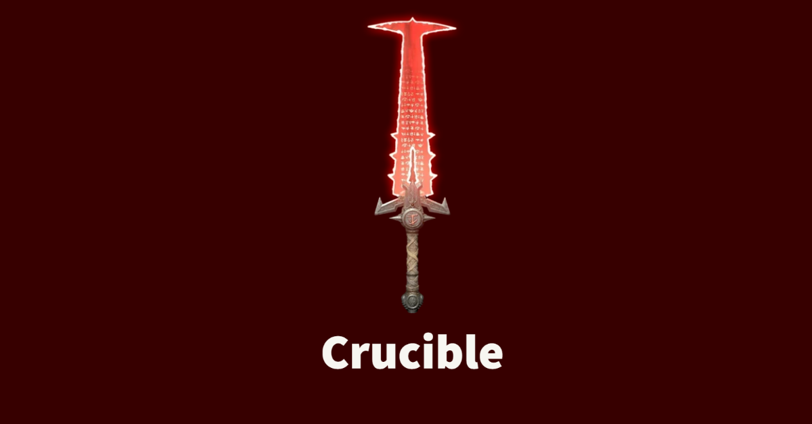

# Crucible

An all-in-one tool for managing your air-gaped deployments with AWX.

---


---

## CLI

```bash
- Available Commands:

  about       Print the info about crucible-cli
  completion  Generate the autocompletion script for the specified shell
  config      list cli configuration
  helm        Helm Helper Commands
  help        Help about any command
  info        info is a palette that contains system info commands
  k3s         K3s Helper Commands
  os          OS Helper Commands

```

---
## Local Dev

### Install AWX on local cluster

```powershell
helm repo add awx-operator https://ansible.github.io/awx-operator/
helm upgrade --install awx-operator awx-operator/awx-operator -n awx --create-namespace
kubectl create ns awx-dev
kubectl apply -f _dev/awx/awx-dev.yaml
```

To reset awx password:
```powershell
kubectl -n awx exec -it awx-dev-<POD_ID> -c awx-dev-web -- awx-manage changepassword admin
```
